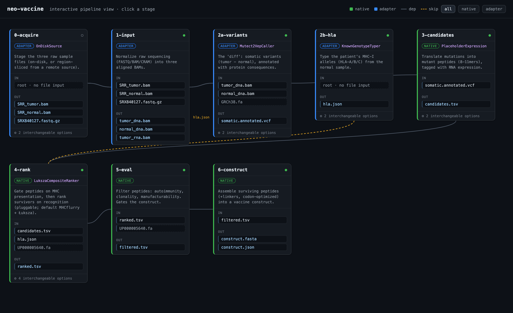
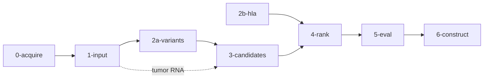
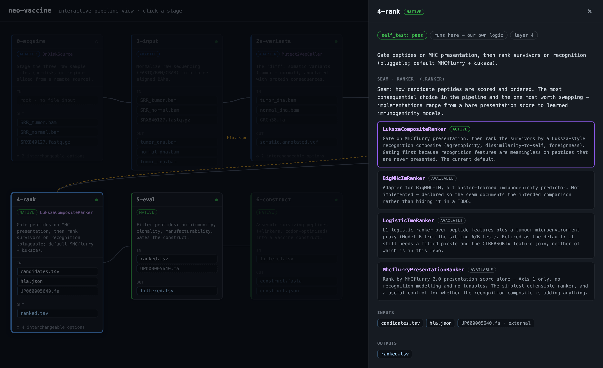

# Neoantigen Vaccine Design Pipeline

A personalized cancer-vaccine **design** pipeline: matched tumor/normal sequencing →
somatic variants → neoantigen candidates → immunogenicity ranking → vaccine construct.

**Scope boundary, stated up front:** this designs a construct *in silico*. It does not
validate efficacy — that needs wet-lab immunogenicity assays (ELISpot, tetramer) or
animal models. The pipeline stops exactly where silicon hands off to the lab, and
nothing here should be read as evidence that a construct would work in a patient.

## Why this exists

Personalized mRNA cancer vaccines are, computationally, a ranking problem: a tumor
carries hundreds of mutations, a vaccine can carry ~20 peptides, and picking the right
20 is what determines whether the immune system responds. The hard part isn't the
plumbing — it's that the field can predict which peptides get *presented* on MHC very
well (~0.95 AUROC), and which presented peptides a T cell will actually *recognize*
quite badly (~0.6 AUC, and that's the honest ceiling, not a local failing).

This repo builds the whole chain end-to-end so the ranking layer — the part that's
actually unsolved — sits behind a clean interface where predictors can be swapped and
compared. See [`docs/review/concepts.md`](docs/review/concepts.md) for the biology and
[`docs/ranking_methodology.md`](docs/ranking_methodology.md) for the citations.



## The pipeline



Execution order is **derived from declared file I/O** (topological sort), not hardcoded
— it's a DAG, not a linear script. The peptide table is one file traveling 3→4→5→6,
gaining columns at each step; stage 5 flags and stage 6 gates on those flags.

| # | Stage | In | Out | Kind |
|---|-------|----|-----|------|
| 0 | acquire | (accessions / on-disk paths) | raw tumor, normal, RNA | adapter |
| 1 | input | raw sample files | normalized, indexed BAMs | adapter |
| 2a | variants | tumor + normal BAM, reference | annotated somatic VCF | adapter |
| 2b | hla | (normal reads, or a known genotype) | `hla.json` | adapter |
| 3 | candidates | annotated VCF | `candidates.tsv` (8–11mers) | native |
| 4 | rank | candidates + HLA + proteome | `ranked.tsv` (+scores) | native |
| 5 | eval | ranked + proteome | `filtered.tsv` (+flags) | native |
| 6 | construct | filtered peptides | `construct.fasta` + `.json` | native |

The image above is a snapshot of an interactive view: click any stage and a drawer
opens with its I/O, its live `self_test` status, and — where the stage has a pluggable
seam — every alternative implementation with its own description, so "what is this
stage using, and what else could it use?" is answerable without reading code.



Everything in that view is derived from the pipeline object itself, so adding a stage
or swapping a strategy updates it with no edits to the renderer. Open
[`NeoantigenVaccineConstructionPipeline/pipeline_view.html`](NeoantigenVaccineConstructionPipeline/pipeline_view.html)
locally (GitHub won't render it), or regenerate with:

```bash
python -m NeoantigenVaccineConstructionPipeline.cases.demo
```

## Architecture

One abstraction. A **`Stage`** is a typed-file transform that declares `inputs` and
`outputs`, implements `run()`, and skips itself when its outputs are newer than its
inputs. A **`Pipeline`** is a set of Stages; it derives execution order from the
declared I/O and can `.validate()` the graph (cycles, duplicate producers, missing
external inputs) without running anything.

Where a stage could reasonably use different tools, the choice is a **`Strategy`**
seam — `AcquireSource`, `VariantSource`, `HlaTyper`, `ExpressionSource`, `Ranker`.
Each has a default that runs today and alternatives that declare their own inputs, so
swapping one re-wires the DAG automatically. This is what makes the ranking layer
comparable rather than baked in.

## How the ranking works

Two axes in series, deliberately not blended into one model:

1. **Presentation gate** — MHCflurry 2.0. Will the peptide be displayed on MHC-I at
   all? Well-solved. Peptides that fail are tagged and sunk, not deleted.
2. **Recognition composite** — Łuksza-style quality on the survivors: agretopicity
   (mutant-vs-wild-type binding), dissimilarity-to-self, and foreignness.

Gating first matters because recognition features are meaningless on peptides that are
never presented — scoring them just adds noise. This is the TESLA consortium's lesson
(Wells et al., *Cell* 2020).

## What has actually been run

Being precise here, because the distinction matters:

- **Structure and contracts.** All 8 stages declare I/O and validate as a DAG. Seven
  carry a `self_test` with hard assertions against in-repo fixtures; **`0-acquire` has
  none.** Stage 4's self-test covers the recognition math only — the MHCflurry calls
  are exercised in the notebook, not by the test.
- **Ranking half, end-to-end on real mutations.** A curated panel of real oncogenic
  hotspots (KRAS G12D/G12V, BRAF V600E, TP53 R175H, PIK3CA H1047R, EGFR L858R) runs
  through windows → gate → composite → construct. **Every output file is committed**
  with provenance in [`docs/review/run_outputs/`](docs/review/run_outputs/), so the
  claims below can be checked against actual output rather than taken on trust. (The
  Colab run in [`notebooks/`](notebooks/option_A_component_test.ipynb) is kept as a
  record of the process, but its saved outputs predate a stage-6 fix — see the note at
  the top of it.)
  **The built-in positive control passes** — KRAS G12D pairs to HLA-C\*08:02, the
  clinically validated restriction ([Tran et al., *NEJM* 2016](https://www.nejm.org/doi/full/10.1056/NEJMoa1609279)),
  and ranks first. Note that the demo HLA panel was *deliberately seeded* with the
  published restricting alleles, so this is a control behaving correctly, **not** a
  discovery.
- **Real-tumour front end.** HCC1395 (SEQC2 benchmark), chr21, from the published
  somatic truth VCF through VEP annotation to a construct — written up in
  [`docs/review/option_B_result.md`](docs/review/option_B_result.md). **This ran
  out-of-tree and no artifacts were committed**, so treat it as reported but not
  currently reproducible. Making it reproducible is open work.

## Limitations

The ones that would change how you read any output:

- **Missense only.** `PROTEIN_ALTERING = {"missense_variant"}` — frameshift, indel and
  fusion neoantigens are not handled. This is a real gap, not a rounding error:
  frameshift-derived neoantigens are widely considered the highest-quality class
  precisely because they're fully novel and escape thymic tolerance.
- **No expression filtering in practice.** The tumor RNA is FASTQ and needs a STAR
  alignment first, so TPM is unknown and the expression gate runs permissive.
- **The recognition axis is partly idle.** Agretopicity is live and drives the ranking.
  Dissimilarity-to-self is a binary MVP (novel=1 / exact-self=0). Foreignness is
  dormant without an IEDB epitope set. Net: the score currently reduces to
  `ln(agretopicity)`. This mirrors the field's state, but don't read it as a full
  implementation of the Łuksza model.
- **Construct selection is the weakest link.** It has no per-mutation dedup, so
  overlapping windows of one mutation compete for slots rather than maximizing mutation
  coverage; and it has no score floor, so peptides whose mutation made MHC binding
  *worse* than wild-type — actively bad targets — still get selected. Both are visible
  in the committed run: 7 peptides covering 4 mutations, 3 with negative scores.
- **Clonality uses raw VAF** as a CCF proxy, uncorrected for purity or copy number.
- **The autoimmunity filter is exact-match only.** Near-match cross-reactivity — the
  actual failure mode in the 2013 titin cardiotoxicity case, see
  [`docs/safety_testing.md`](docs/safety_testing.md) — would not be caught.

## Testing

Each `Stage` may define `self_test()`; `Pipeline.test()` runs them all and
`Stage.test_status()` reports pass / fail / no-test. These are hard assertions against
fixtures, not smoke tests — stage 3 round-trips a KRAS G12D VCF through the real CSQ
parser and asserts the exact peptide windows; stage 4 asserts the agretopicity,
dissimilarity and composite math; stage 2a round-trips its VCF writer *through stage 3's
parser*, proving the hand-off is byte-compatible.

There is no `pytest` suite, and tool execution (samtools, GATK, VEP, OptiType) is not
covered — those stages test their own parsers and command planners, and defer execution.

```bash
python -m NeoantigenVaccineConstructionPipeline.pipeline   # usage
# build_pipeline(case).validate()  -> dry preflight, no execution
# build_pipeline(case).run()       -> execute
```

Dependencies: `pandas`, `numpy`, and `mhcflurry` (plus
`mhcflurry-downloads fetch models_class1_presentation`) for stage 4.

## Data

Public, no access approval needed: **HCC1395/HCC1395BL** (breast, SEQC2 benchmark) and
**COLO829/COLO829BL** (melanoma) as matched tumor/normal pairs, plus TCGA open-tier MAFs
for breadth. Controlled-access dbGaP BAMs are routed around, not required.

## Repo map

| Path | What |
|------|------|
| `core.py` | `Stage`, `Pipeline`, `Strategy`, topological sort, validation |
| `viz.py` | renders any Pipeline to the interactive HTML view |
| `NeoantigenVaccineConstructionPipeline/stages/` | one package per stage, each with its own README |
| `notebooks/` | executed end-to-end runs |
| `docs/review/run_outputs/` | every file a real run produced, with provenance |
| `docs/review/` | a cold-read walkthrough: what was built, how to read the output, the biology |
| `docs/ranking_methodology.md` | why this ranker, with citations |
| `docs/safety_testing.md` | what the autoimmunity filter does and doesn't cover |
